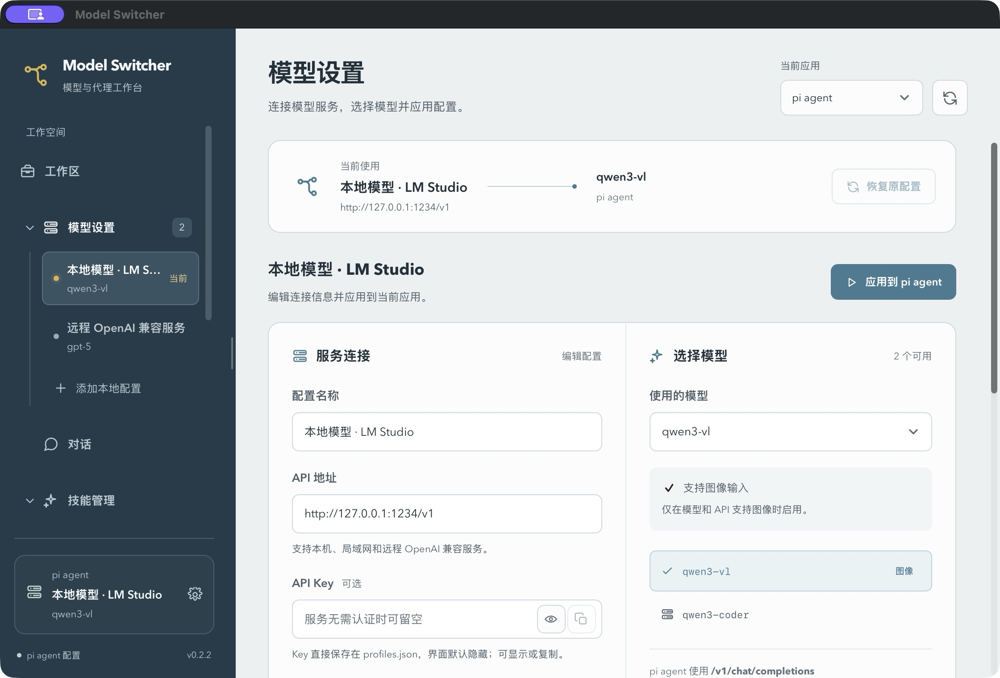
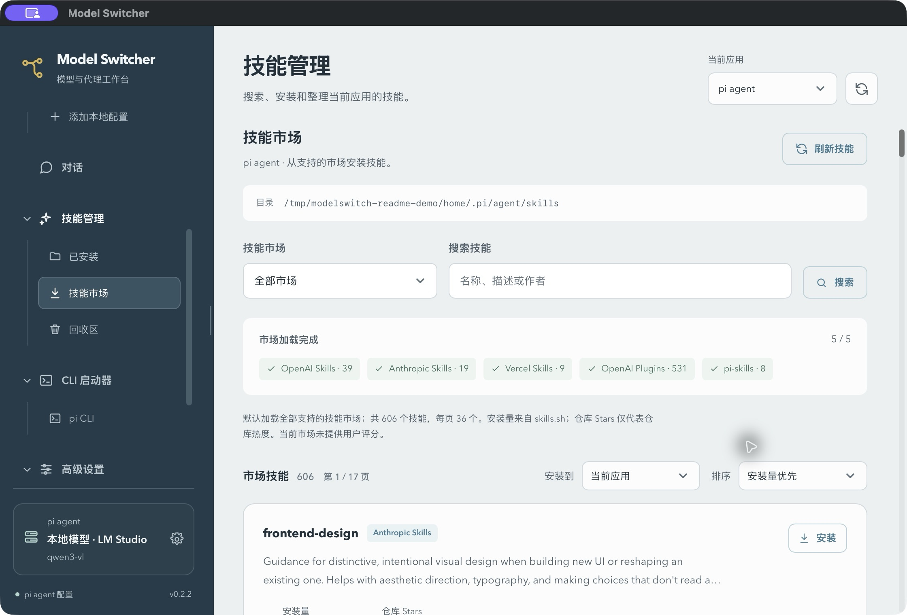

# Model Switcher

[](https://github.com/zhoumo99567/modelswitch/releases/latest)
[](https://github.com/zhoumo99567/modelswitch/actions/workflows/release.yml)
[](https://github.com/zhoumo99567/modelswitch/stargazers)

一个面向 **ChatGPT / Codex** 和 **pi agent** 的桌面控制中心：集中管理 OpenAI 兼容模型、API 配置、技能市场、共享记忆和 CLI 启动器。

Model Switcher 适合需要在本地模型、云端模型和不同 Agent 之间频繁切换的人。配置保存在本机，应用可以直接读取本地模型列表、更新 Agent 配置，并从技能市场安装或清理技能。

## 界面预览

### 模型设置



### 技能市场



截图使用脱敏演示配置，不包含真实 API Key 或个人文件内容。

## 主要能力

| 能力 | 说明 |
| --- | --- |
| 模型配置 | 管理多个 OpenAI 兼容服务，读取 `/v1/models`，选择模型并保存为配置档案 |
| ChatGPT / Codex | 写入受管控的 provider 配置，使用 `/v1/responses` 协议调用模型 |
| pi agent | 管理 `models.json`，支持 `/v1/chat/completions`，可标记模型支持图像输入 |
| API Key | 直接保存到本地 `profiles.json`；界面默认用 `*` 隐藏，可点击眼睛查看或复制 |
| 技能市场 | 支持 OpenAI Skills、Anthropic Skills、Vercel Skills、OpenAI Plugins 和 `pi-skills` |
| 技能排序与元数据 | 按安装量、仓库 Stars、名称或市场排序；显示作者、许可、版本、来源和统计入口 |
| 技能维护 | 安装、批量清理、回收区恢复；同名目录不会覆盖，系统技能受保护 |
| CLI 启动器 | 从界面启动 pi CLI 或 Codex CLI，并检测、安装 Node.js、npm 和 CLI 依赖 |
| 共享记忆 | 通过 `~/.agents/memory` 共享全局记忆和项目记忆，保留 Codex 与 pi 的原生设置 |
| 高级配置 | 查看或编辑 MCP、运行参数和记忆索引；写入前自动校验并备份 |
| 便携配置 | 默认读取应用同级 `profiles.json`，适合把配置和程序一起迁移 |
| 窗口状态 | 记住上次正常关闭时的位置和大小；显示器不再适用时自动居中恢复 |

## 快速开始

### 下载安装

前往 [Releases](https://github.com/zhoumo99567/modelswitch/releases/latest) 下载对应平台的最新版本：

- **Windows**：下载 `ModelSwitcher-<version>-windows-amd64.exe` 后直接运行。
- **macOS**：下载 `ModelSwitcher-<version>-macos-universal.app.zip`，解压后把 App 移到实际目录（例如“应用程序”）再打开。

如果 macOS 仍提示来自未知开发者，确认文件来源后可以在终端执行：

```bash
xattr -dr com.apple.quarantine ModelSwitcher.app
```

### 第一次配置模型

1. 在左侧顶部选择 **ChatGPT / Codex** 或 **pi agent**。
2. 打开“模型设置”，新建一个配置，填写名称和 API Base URL，例如 `http://127.0.0.1:1234/v1`。
3. 点击“获取模型”，选择模型并保存。
4. ChatGPT / Codex 服务需要兼容 `/v1/responses`；pi agent 使用 `/v1/chat/completions`。
5. 如果模型支持视觉输入，在 pi agent 配置中勾选“支持图像输入”。
6. 点击“应用切换”，再使用“测试对话”验证当前协议、模型和 Key。

复用配置时，在“服务连接”底部点击 **复制配置**，名称、API 地址、Key、选中模型和各模型的图像能力、上下文大小会复制到剪贴板。然后点击左侧“添加本地配置”下方的 **粘贴配置**，检查或修改新配置并保存。这些操作同时支持 ChatGPT / Codex 和 pi agent，也可在另一台电脑的 Model Switcher 中粘贴。

## 技能市场

进入左侧 **技能管理 → 技能市场**：

1. 选择一个市场，或选择“全部市场”。市场会并行加载，某个市场失败不会阻塞其他市场。
2. 使用名称、描述或作者搜索技能。
3. 选择排序方式：安装量、仓库 Stars、名称或市场。
4. 展开技能卡片查看描述、作者、许可、版本、仓库和统计来源。
5. 选择“当前应用”或“共享技能”，点击“安装”。

统计字段的含义：

- **安装量**来自 [skills.sh](https://skills.sh/) 的公开记录，不等于全网下载量。
- **仓库 Stars**代表整个 GitHub 仓库的热度，不是单个技能评分。
- 当前市场没有统一的用户评分，界面会明确显示“未提供”，不会把缺失值显示成 0。

支持的市场：

| ID | 市场 |
| --- | --- |
| `openai` | OpenAI Skills |
| `anthropic` | Anthropic Skills |
| `vercel` | Vercel Skills |
| `openai-plugins` | OpenAI Plugins |
| `pi-skills` | [badlogic/pi-skills](https://github.com/badlogic/pi-skills) |

已安装技能可以在“已安装”中批量清理。清理会移动到当前技能目录的 `.trash`，之后可以从“回收区”恢复；不会覆盖同名目录，也不会删除 `.system`。

## 共享记忆与 Agent 配置

Model Switcher 只管理本机文件，不会把配置文件上传到 Model Switcher 服务。当前 API Key 按用户要求以明文写入 `profiles.json`，界面默认隐藏显示；请保护好该文件，不要提交到 Git 仓库或公开备份中。

| 配置 | 默认位置 | 用途 |
| --- | --- | --- |
| 便携模型配置 | 应用同级 `profiles.json` | Model Switcher 的配置档案和 API Key |
| Codex 配置 | `~/.codex/config.toml` | 受管控的 provider、MCP 与运行参数 |
| Codex 技能 | `~/.codex/skills` | ChatGPT / Codex 使用的全局技能 |
| pi agent 配置 | `~/.pi/agent` | `models.json`、`settings.json`、技能和扩展 |
| pi 技能 | `~/.pi/agent/skills` | pi agent 使用的全局技能 |
| 共享记忆 | `~/.agents/memory` | 全局记忆、项目记忆和自动生成的 `INDEX.md` |
| 窗口状态 | 系统配置目录 `ModelSwitcher/window-state.json` | 窗口位置和大小 |

设置页会显示程序本次实际读取的 `profiles.json` 路径。macOS 解压后可直接从下载目录运行，无需移动到 `/Applications`：即使系统使用 AppTranslocation 临时目录，程序也会解析 App 的原始位置，优先读取和保存原始 App 同级的 `profiles.json`。如果原目录不可写（例如只读磁盘映像），则为这份 App 使用用户目录中的独立配置副本。凭据助手使用明确的配置路径，避免读取另一份配置中的 Key。

共享记忆会保留已有的 `AGENTS.md`、`SYSTEM.md`、`APPEND_SYSTEM.md` 和 Agent 的 settings。已打开的 pi 会话在记忆或技能更新后执行 `/reload`，让新内容生效。

## CLI 启动器

左侧 **CLI 启动器**可以启动当前 Agent 对应的 CLI：

- ChatGPT / Codex：Codex CLI
- pi agent：pi CLI

启动器会显示检测到的命令路径和工作目录。缺少依赖时可以从页面安装或修复：

- Node.js 与 npm
- pi agent
- Codex CLI

应用会优先使用系统中已有的工具；用户目录安装的位置由页面显示，不会强行修改系统 `PATH`。pi 的内置对话和 CLI 共享 `PI_CODING_AGENT_DIR` 下的资源。

## 开发

环境要求：Go 1.23、Node.js 22、npm，以及 [Wails v2](https://wails.io/)。

```bash
# 安装前端依赖
npm --prefix frontend ci

# 开发模式
wails dev

# 前端测试与生产构建
npm --prefix frontend test
npm --prefix frontend run build

# Go 测试
GOTOOLCHAIN=go1.23.12 go test -race ./...
```

如果本机没有 Wails CLI，可以使用项目当前固定版本：

```bash
go install github.com/wailsapp/wails/v2/cmd/wails@v2.12.0
```

## 构建与发布

版本号以根目录 `VERSION` 为准，并同步更新 `wails.json` 中的 `info.productVersion`。本地构建：

```bash
# macOS
zsh ./scripts/release-macos.sh

# Windows PowerShell
pwsh ./scripts/release.ps1
```

脚本会在 `release/<version>/` 中生成当前平台的安装包、`latest.json` 和 `SHA256SUMS.txt`。GitHub Actions 会分别构建 Windows 与 macOS，汇总两个安装包后发布完整 Release。

推送版本标签会触发 GitHub Actions 的双平台构建和 Release 发布：

```bash
git add VERSION wails.json
git commit -m "Release v0.2.3"
git push origin main

git tag -a v0.2.3 -m "Release v0.2.3"
git push origin v0.2.3
```

没有配置更新源时，本地脚本只生成本地清单，不会上传文件。发布流程不会把 S3 凭据写入代码或配置文件。

## 项目结构

```text
.
├── app.go                  # Wails 应用入口与配置路径
├── config.go               # ChatGPT / Codex provider 配置
├── pi.go                   # pi agent 配置读写
├── pi_chat.go              # pi 协议调用
├── skills.go               # 技能市场、安装和清理
├── memory_vault.go         # 共享记忆库
├── frontend/               # 前端页面与交互
├── scripts/                # 构建、发布和清单脚本
└── docs/images/            # README 截图
```

## 参与贡献

欢迎提交 [Issue](https://github.com/zhoumo99567/modelswitch/issues) 报告问题或提出功能建议，也欢迎提交 Pull Request。涉及模型协议、配置文件和技能安装的改动，请同时补充对应的 Go 或前端测试。

## 许可证

当前仓库未附带独立许可证文件。若要在其他项目中再分发，请先联系仓库维护者确认授权方式。
